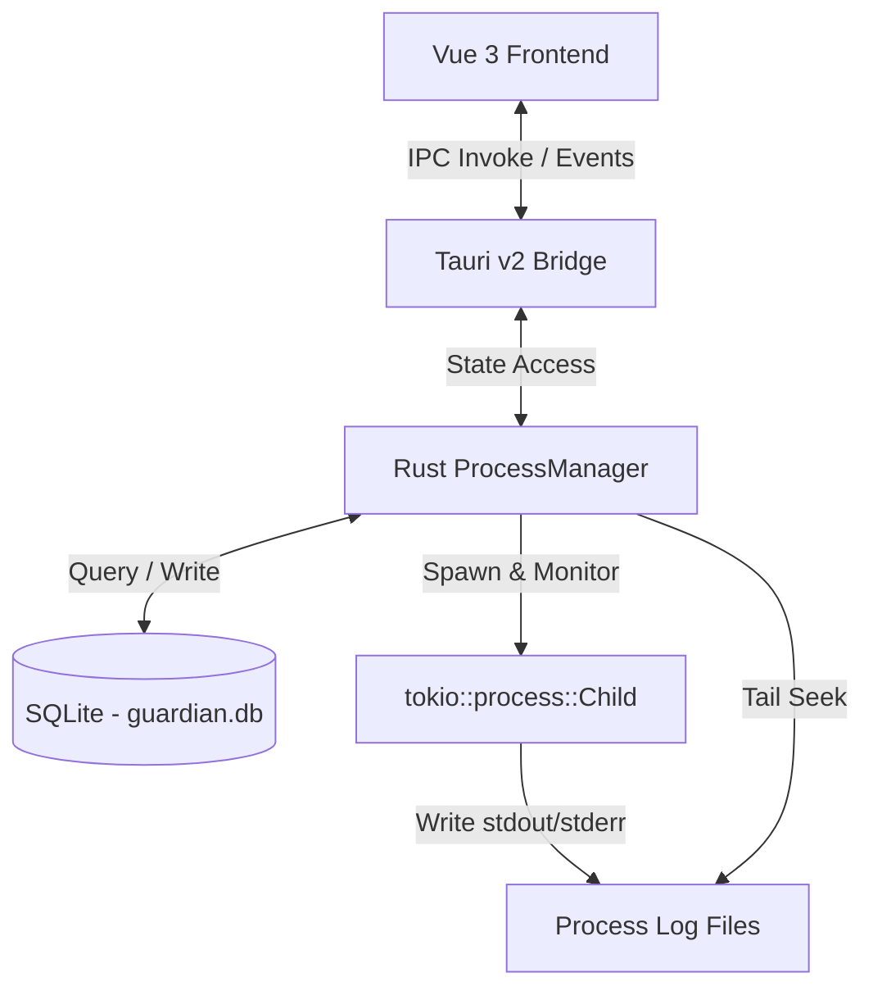

# Guardian - Windows Process Supervisor

Guardian is a lightweight, modern, and high-performance desktop application designed to run and monitor background processes on Windows. Inspired by Linux's `supervisor`, Guardian ensures your custom commands and executables run continuously, recover automatically from crashes, and stream real-time logs through a beautiful dark-themed glassmorphic user interface.

Developed using **Rust (Tauri v2)** for the backend process manager and **Vue 3 + TypeScript** for the dashboard UI.

---

## Key Features

- 🖥️ **Windows Console Prevention**: Launches processes completely in the background without flashing native Windows CMD/PowerShell terminal frames (`CREATE_NO_WINDOW` flag integration).
- 🔄 **Automatic Restart (Auto-Recovery)**: Automatically detects when a process exits or crashes (non-zero status codes) and spawns it back after a 2-second cooldown, respecting configurable retry limiters.
- ⚡ **Auto-Start on Boot**: Processes marked as `auto_start` are automatically spawned on application launch, restoring your background workspace states instantly.
- 🗄️ **SQLite Storage Engine**: All process configurations are stored in an atomic local SQLite database (`guardian.db`) rather than plain JSON files, ensuring stability and query-level atomicity.
- 📂 **Native File Dialog**: Click a button to browse and select executable files (`.exe`, `.bat`, `.cmd`, `.ps1`, etc.) directly from your system.
- 🌳 **Process Tree Termination**: When stopping a process, Guardian executes a recursive forced termination (`taskkill /F /T`) to ensure that any spawned sub-processes are completely killed, preventing orphaned processes.
- 📋 **Real-time Log Streaming & Tailing**:
  - Automatically captures both `stdout` and `stderr` streams.
  - Writes logs asynchronously to dedicated process log files on disk.
  - Implements a high-performance backward file tailing system (using reverse search offsets) to display the last `N` lines instantly.
  - Streams logs to a monospaced log terminal with auto-scroll toggling.
- 🎨 **Premium Glassmorphic Dashboard**: A sleek dark mode UI designed with Inter typography, JetBrains Mono terminal, and customized animated **SweetAlert2** alerts and deletion dialogs.

---

## System Architecture



---

## Directory & File Locations (Windows)

All data files are located in the standard Windows AppData Roaming folder:

- **Database File**: `C:\Users\<Username>\AppData\Roaming\com.beyhan.guardian\guardian.db`
- **Process Logs Directory**: `C:\Users\<Username>\AppData\Roaming\com.beyhan.guardian\logs\<process_id>.log`

---

## Installation & Setup

### Prerequisites

To compile and run Guardian, you must have the following installed on your machine:
- **Node.js** (v18+)
- **pnpm** (Recommended package manager)
- **Rust Toolchain** (via `rustup`)
- **C++ Build Tools** (installed automatically via Visual Studio installer or rustup windows toolchain)

### Steps

1. **Clone the Repository:**
   ```bash
   git clone https://github.com/beyhano/guardian.git
   cd guardian
   ```

2. **Install Frontend Dependencies:**
   ```bash
   pnpm install
   ```

3. **Run in Development Mode:**
   This command starts the Vite development server and launches the Tauri desktop application.
   ```bash
   pnpm tauri dev
   ```

4. **Build Production Executable:**
   This compiles the optimized production version and packs it into a standalone Windows installer (`.msi` or `.exe`).
   ```bash
   pnpm tauri build
   ```

---

## Configuration & Customization (CLAUDE.md)

Developer instructions, styling guidelines, and strict architectural constraints (e.g. FFI limitations, compilation targets, and auto-resume hooks) are documented in the [CLAUDE.md](file:///c:/Users/beyhan/Desktop/Projeler/Rust/guardian/CLAUDE.md) developer guide.

---

## License

This project is open-source and available under the MIT License.
